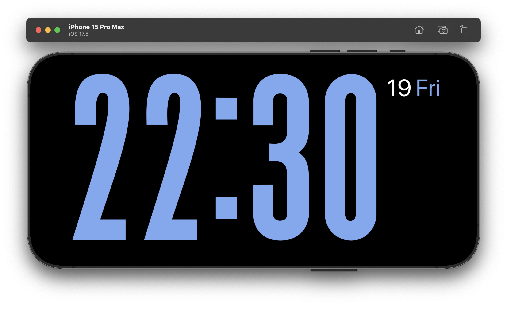
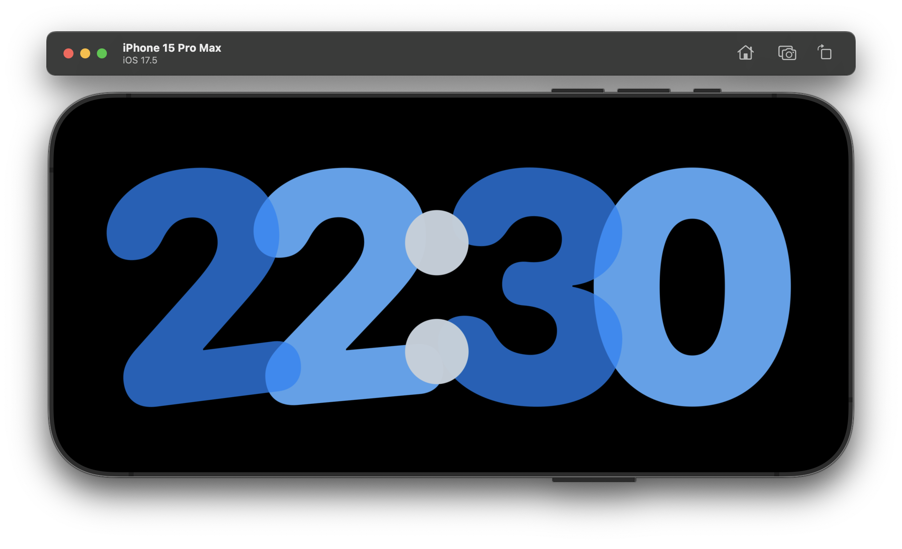
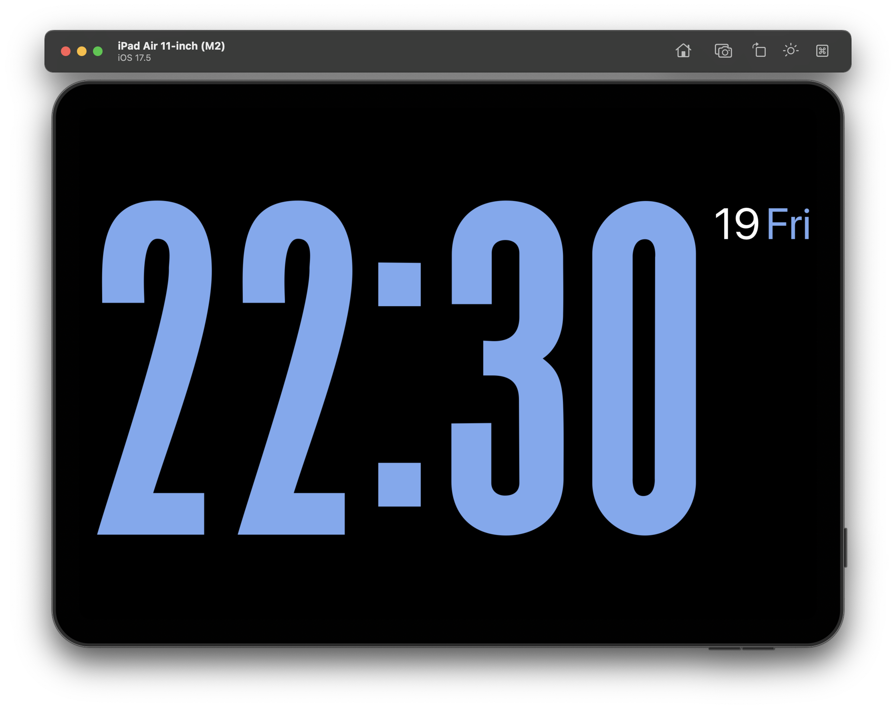
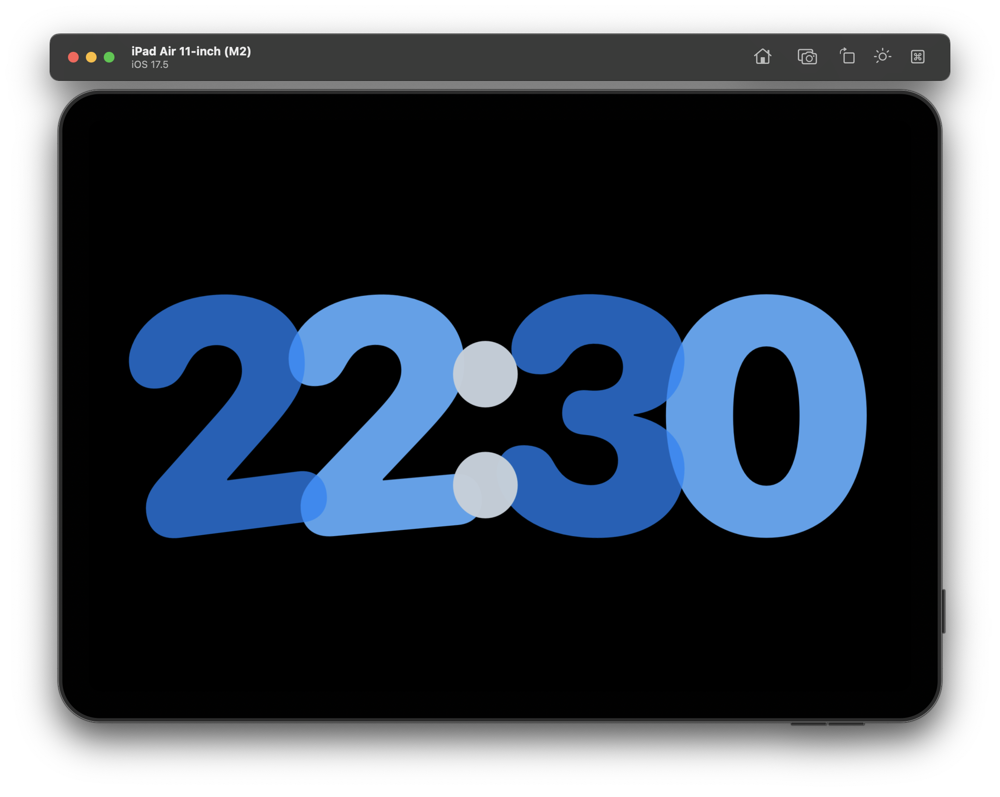

<h1 align="center">
   
  
   
Standby
   
</h1>

<h4 align="center">A minimal Clock application for iPhone / iPad and Mac</a>.</h4>

  </a>

 

## Screenshot

|  |  |
| ------------------------------------------------------------ | ------------------------------------------------------------ |
|  |  |